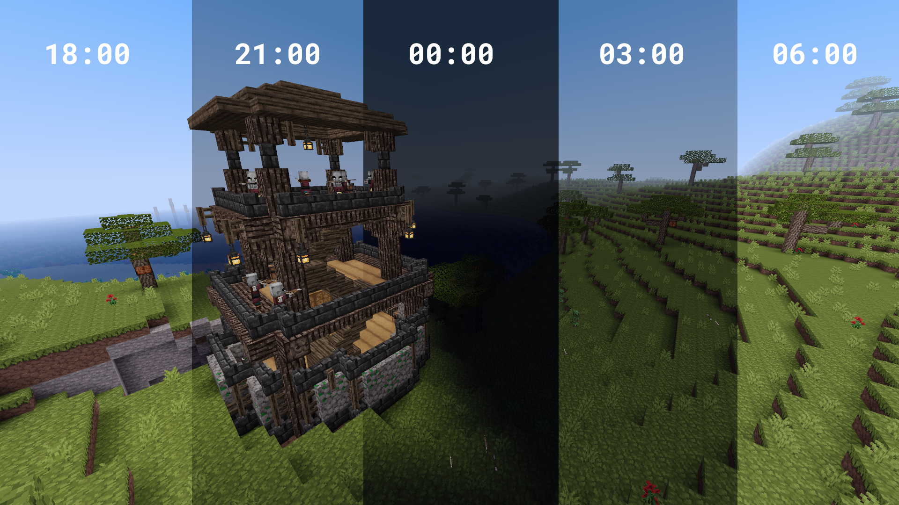

# Solar Phases

A Minetest mod to simulate variable daytime lengths, including polar day / night.

The Z axis describes the latitude. the higher z is, the stronger the effects are (like in the real world). While on z = 0 daytime is constant, at some point you can experience polar day (it won't get dark) / polar night (it barely gets bright).

The X axis describes "timezone offset". True noon shifts as X inc/decreases. This mimics effects from the real world like Daylight Savings or very wide timezones.

This is not scientifically accurate, but an approximation.

Sun, Moon and Stars are disabled, because they are hardcoded to the time of day. If kept on, there would either be stars at day or sun at night. They are hidden every globalstep to counteract other games/mods updating the sky. This might cause some flickering. No side effects in Minetest Game.

You can also use `/setdays [days]` to set the day to a float. This doesn't change the ingame day count as I've not found a way for that, it keeps an offset in the background to calculate brightness of the day correctly.

Spawning on a random position in the world is out of scope of this mods functionality and therefore not included.